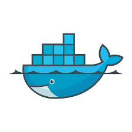

---
### SQL Alchemy: Essencial

---

*  instalar o docker


[](https://www.docker.com/products/docker-desktop/)

* ## configurar o ambiente do python na ultima versão

  [](https://hub.docker.com/_/python/)

    utilisando o terninal dogite o seginte  📝 `comando:`

    ```bash
    docker pull python
    ````

* confirmar a versão instalada

     📝`comando:`

    ````bash
    python --version
    ````

* :heavy_check_mark: Resposta:

    ````bash
      Python 3.11.0
    ````

* ##  Instalar os pacontes nescessarios para fazer a aula

    ````bash
    pip install --require-hashes -r requirements.txt
    ````
---
* :negative_squared_cross_mark:  **Sessão: 1- Apresentação**
---
 :negative_squared_cross_mark: 1. Sobre o curso

   

 :negative_squared_cross_mark: 2. Como conseguimos te ajudar


---
* :negative_squared_cross_mark: **Sessão:2- Introdução ao SQL Alchemy**
---

:negative_squared_cross_mark: 3. O que vamos aprender nesta seção?
 :negative_squared_cross_mark: 4. Introdução ao SQLAlchemy [PDF](https://github.com/masterCredd/python_sqlAchemy/blob/master/python_sqlachemy/Introdução)


 :negative_squared_cross_mark: 5. Casos de sucesso do SQLAlchemy [PDF](https://github.com/masterCredd/python_sqlAchemy/blob/6907f3024dd8b670e1c29201788be8b6baf5f318/python_sqlachemy/Introdução)

:negative_squared_cross_mark: 6. Entendendo a Arquitetura do SQLAlchemy [PDF]
:negative_squared_cross_mark: 7. Recapturando


* :negative_squared_cross_mark: **Sessão:3- Modelagem de Dados com SQLAlchemy**

* :negative_squared_cross_mark: 8. O que vamos aprender nesta seção?
  <br/>
  <br/>

 

  * **(PDF)**

  * create engine docker bd postgres

````bash
docker-coomposer up -d
````

:negative_squared_cross_mark: 9.  Prática: Criando a Estrutura do Projeto - **Parte 1**
:negative_squared_cross_mark: 10. Prática: Criando a Estrutura do Projeto - **Parte 2**
 :negative_squared_cross_mark: 11. Prática: Criando a Models - **Parte 1**

* [ ] 12. Prática: Criando a Models - **Parte 2**
* [ ] 13. Prática: Criando a Models - **Parte 3**
* [ ] 14. Prática: Criando as tabelas no banco de dados
* [ ] 15. Recapturando


---
**Sessão:4-Manipulando Dados com SQLAlchemy**

---

* [ ] 16. O que vamos aprender nesta seção?
* [ ] 17. Entendendo o Padrão Unit of Work **(PDF)**
* [ ] 18. Prática: Inserindo Dados - Create(`Insert`) - **Parte 1**


* [ ] 19. Prática: Inserindo Dados - Create(`Insert`) - **Parte 2**
* [ ] 20. Prática: Zerando e Populando o Banco de Dados
* [ ] 21. Prática: Buscando Dados - Read(`Select`) - **Parte 1**
* [ ] 22. Prática: Buscando Dados - Read(`Select`) - **Parte 2**
* [ ] 23. Compreendendo melhor relacionamentos
* [ ] 24. Prática: Atualizando Dados - `Update`
* [ ] 25. Prática: Deletando Dados  - `Delete`
* [ ] 26. Recapturando
---
**Sessão:5- SQLAlchemy Assíncrono**

---

* [ ] 27. O que vamos aprender nesta seção?
* [ ] 28. Revisando a Programação Assíncrona
* [ ] 29. Prática: Refaturando o Projeto
* [ ] 30. Prática: Refatorando o arquivo db_session.py
* [ ] 31. Prática: Refatorando o Insert
* [ ] 32. Prática: Refatorando Zerar a Base e Popular
* [ ] 33. Prática: Refatorando Select - **Parte 1**
* [ ] 34. Prática: Refatorando Select - **Parte 2**
* [ ] 35. Prática: Refatorando Update
* [ ] 36. Prática: Refatorando Delete
* [ ] 37. Recapturando

---
**Sessão:6- (Extra) SQL Model**

---

* [ ] 38. O que vamos aprender nesta seção?
* [ ] 39. Introdução ao SQL Model **(PDF)**
* [ ] 40. Prática: Refatorando o Projeto
* [ ] 41. Prática: Refatorando os Models - **Parte 1**
* [ ] 42. Prática: Refatorando os Models - **Parte 2**
* [ ] 43. Prática: Refatorando o arquivo db_session.py
* [ ] 44. Prática: Refatorando o Insert
* [ ] 45. Prática: Refatorando Zerar a Base e Popular
* [ ] 46. Prática: Refatorando Select - **Parte 1**
* [ ] 47. Prática: Refatorando Select - **Parte 2**
* [ ] 48. Prática: Refatorando Update
* [ ] 49. Prática: Refatorando Delete
* [ ] 50. Recapturando

---
**Sessão:7- (Extra) SQL Model Assíncrono**

---

* [ ] 51. O que vamos aprender nesta seção?
* [ ] 52. Prática: Refatorando o Projeto
* [ ] 53. Prática: Refatorando o arquivo db_session.py
* [ ] 54. Prática: Refatorando o Insert
* [ ] 55. Prática: Refatorando Zerar a Base e Popular
* [ ] 56. Prática: Refatorando Select - **Parte 1**
* [ ] 57. Prática: Refatorando Select - **Parte 2**
* [ ] 58. Prática: Refatorando Update
* [ ] 59. Prática: Refatorando Delete
* [ ] 60. Recapturando
---
**Sessão:8- Encerramento**

---

* [ ] 61. Recapturando
* [ ] 62. Quais os Próximos passos
