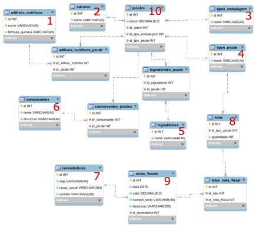

**Sessão:3- Modelagem de Dados com SQLAlchemy**
---

* :negative_squared_cross_mark: 8. O que vamos aprender nesta seção?
  <br/>
  <br/>
 

  * **(PDF)**

  * create engine docker bd postgres

        ````bash
        docker-coomposer up -d
        ````

* :negative_squared_cross_mark: 9.  Prática: Criando a Estrutura do Projeto - **Parte 1**
* :negative_squared_cross_mark: 10. Prática: Criando a Estrutura do Projeto - **Parte 2**
* [ ] 11. Prática: Criando a Models - **Parte 1**
* [ ] 12. Prática: Criando a Models - **Parte 2**
* [ ] 13. Prática: Criando a Models - **Parte 3**
* [ ] 14. Prática: Criando as tabelas no banco de dados
* [ ] 15. Recapturando
